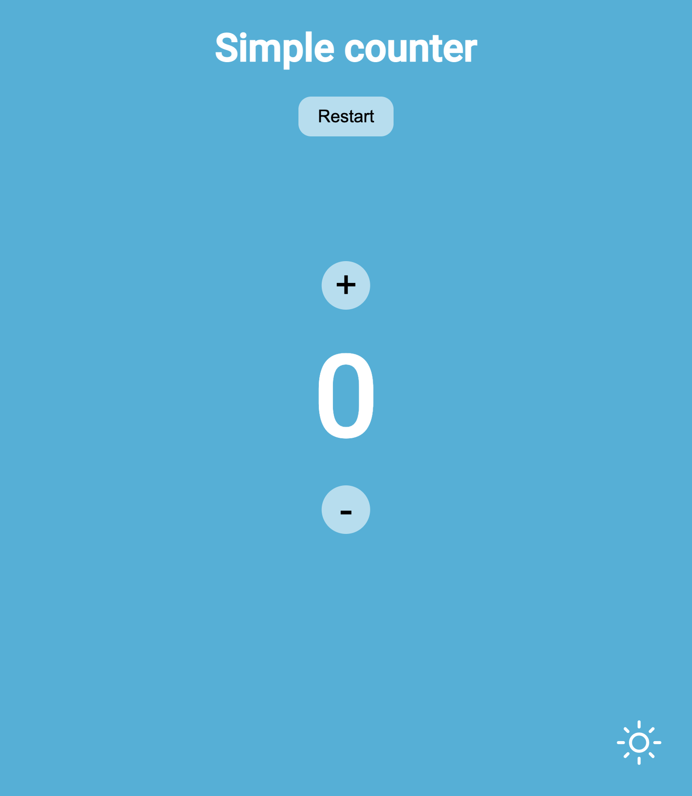

# Simple counter
[Demo](https://yasya23.github.io/simple-counter/)

## Overview

Simple counter of positive integers adapted to all devices. There is a light and dark background theme switcher and a reset button. If the number is less than zero, a minus button disappears. 

### Built with

- HTML5
- CSS
- JS

### Screenshot

